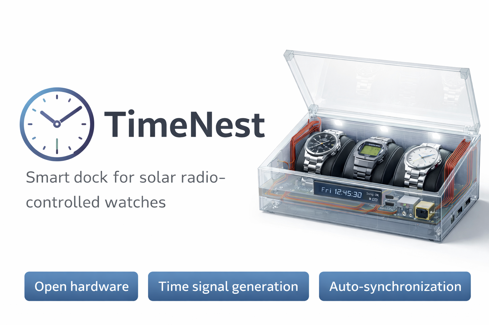

# TimeNest

  

**TimeNest** is an open hardware dock that stores and automatically synchronizes radio-controlled solar watches using a locally generated low-frequency time signal.

The device acts as a **watch storage case, time synchronization beacon, and solar charging station**.

Watches placed inside the dock can synchronize reliably even in locations with poor LF radio reception.

---

## Overview

Many radio-controlled watches rely on long-wave radio signals (such as DCF77) to synchronize their time automatically.  
However, indoor reception can often be unreliable due to building structures and interference.

**TimeNest** solves this by generating a **local time signal** synchronized via the internet (SNTP) and transmitting it inside the watch case.

The result is a simple workflow:

1. Place watches inside the case  
2. Close the lid  
3. Watches synchronize automatically

---

## Features

### Radio Time Beacon

- Local generation of radio time signals (DCF77 initially)
- Near-field magnetic antenna
- Adjustable transmission power
- Designed to operate only within the watch case

### Watch Dock

- Storage for multiple watches
- Transparent lid
- Embedded antenna coils inside the case walls
- Elegant desk-friendly design

### Solar Charging

- LED illumination for solar watches
- Configurable brightness
- Optional ambient light sensing
- Illumination scheduling (e.g. daylight simulation)

### Connectivity

- Ethernet time synchronization (SNTP)
- Web configuration interface
- USB serial console for debugging and configuration

### Display

- Current time
- Synchronization status
- Transmission status
- System diagnostics

---

## System Architecture

- RP2040
    - Ethernet MAC + PHY (SPI)
    - lwIP + FreeRTOS
    - SNTP client
    - HTTP configuration server
    - USB serial console
    - DCF77 signal generator
    - external DAC
    - antenna driver
    - LED lighting control
    - display driver

---

## Hardware

Main components include:

- RP2040 microcontroller
- SPI Ethernet controller
- external DAC for signal generation
- resonant LF antenna coils
- LED lighting system
- small display
- optional RTC

Hardware design files can be found in:

hardware/pcb

---

## Antenna

TimeNest uses **near-field magnetic transmission**.

Two coils embedded in the case walls generate a uniform magnetic field inside the watch compartment, allowing reliable synchronization for all watches inside the box.

---

## Enclosure

The enclosure is a **3D-printed watch case** designed to hold multiple watches.

Features include:

- transparent lid
- integrated antenna coils
- solar charging LEDs
- front status display
- rear connectors (Ethernet, USB, power)

CAD files are located in:

enclosure/cad

---

## Repository Structure

- TimeNest
    - firmware/ RP2040 firmware
    - hardware/ schematics and PCB layout
    - enclosure/ CAD models and STL files
    - docs/ design notes and documentation
    - images/ renders and photos

---

## Roadmap

| Feature | Status |
|-------|--------|
| Project concept | ✅ done |
| System architecture | 🔄 in progress |
| RP2040 platform selection | 🔄 in progress |
| DCF77 signal generator | ⏳ planned |
| DAC output stage | ⏳ planned |
| Antenna design | ⏳ planned |
| Ethernet networking | ⏳ planned |
| SNTP time synchronization | ⏳ planned |
| Web configuration interface | ⏳ planned |
| USB debug interface | ⏳ planned |
| Solar charging LEDs | ⏳ planned |
| Enclosure CAD design | ⏳ planned |
| Multi-protocol support (WWVB / MSF / JJY) | 💡 future idea |

Legend:

⏳ planned

🔄 in progress

✅ done

💡 future idea

---

## Development Log

- 2026-03 — project started
- architecture defined
- antenna concept explored
- enclosure concept designed

More updates will be added as development progresses.

---

## Getting Started

Documentation and assembly instructions will be added as the hardware and firmware mature.

---

## License

License to be determined.

---

## Contributing

Contributions, ideas, and feedback are welcome.

If you are interested in:

- RF design
- embedded firmware
- mechanical design
- watch technology

feel free to open an issue or start a discussion.

---

## Project Status

TimeNest is currently in **early development**.