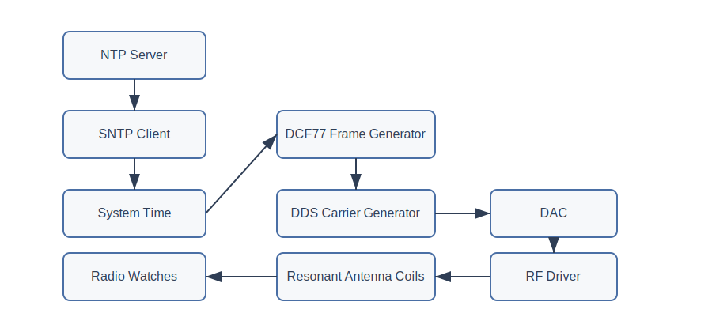

# TimeNest

  

**TimeNest** is an open hardware dock that stores and automatically synchronizes radio-controlled solar watches using a locally generated low-frequency time signal.

The device acts as a **watch storage case, time synchronization beacon, and solar charging station**.

Watches placed inside the dock can synchronize reliably even in locations with poor LF radio reception.

---

## Overview

Many radio-controlled watches rely on long-wave radio signals (such as DCF77) to synchronize their time automatically.  
However, indoor reception can often be unreliable due to building structures and interference.

**TimeNest** solves this by generating a **local time signal** synchronized via the internet (SNTP) and transmitting it inside the watch case.

The result is a simple workflow:

1. Place watches inside the case  
2. Close the lid  
3. Watches synchronize automatically

---

## Features

### Radio Time Beacon

- Local generation of radio time signals (DCF77 initially)
- Near-field magnetic antenna
- Adjustable transmission power
- Designed to operate only within the watch case

### Watch Dock

- Storage for multiple watches
- Transparent lid
- Embedded antenna coils inside the case walls
- Elegant desk-friendly design

### Solar Charging

- LED illumination for solar watches
- Configurable brightness
- Optional ambient light sensing
- Illumination scheduling (e.g. daylight simulation)

### Connectivity

- Ethernet time synchronization (SNTP)
- Web configuration interface
- USB serial console for debugging and configuration

### Display

- Current time
- Synchronization status
- Transmission status
- System diagnostics

---

## System Architecture

- RP2040
    - Ethernet MAC + PHY (SPI)
    - lwIP + FreeRTOS
    - SNTP client
    - HTTP configuration server
    - USB serial console
    - DCF77 signal generator
    - external DAC
    - antenna driver
    - LED lighting control
    - display driver

## Platform Choice: RP2040

TimeNest is built around the **RP2040 microcontroller** rather than a microcontroller with an integrated Ethernet MAC. This decision was made deliberately based on several engineering and practical considerations.

### Availability and Supply Stability

One of the primary design goals for TimeNest is long-term reproducibility. During the global semiconductor shortages of 2020–2023 many commonly used MCUs became difficult to source, often with lead times exceeding a year.

The RP2040 demonstrated unusually strong supply stability during that period and remains widely available through multiple distributors. This makes it a reliable choice for a project intended to be reproducible by others in the future.

### Cost Efficiency

The RP2040 is inexpensive compared to many microcontrollers with integrated Ethernet peripherals. Even when combined with an external SPI Ethernet controller, the overall bill of materials remains competitive while retaining design flexibility.

### Strong Ecosystem

The RP2040 has a large and active ecosystem:

- extensive documentation
- a widely used SDK
- strong hobbyist and open hardware community
- support for multiple development environments

This lowers the barrier for contributors and improves long-term maintainability of the project.

### Deterministic Peripherals (PIO)

The RP2040 includes **Programmable I/O (PIO)** peripherals which allow precise timing control independent of the CPU.

This capability is particularly valuable for TimeNest because the device must generate a very stable **low-frequency radio time signal**. Using PIO allows deterministic waveform generation while the main CPU handles networking and other tasks.

### Dual-Core Architecture

The RP2040 provides two CPU cores, which allows the firmware to separate responsibilities:

- one core can handle networking, configuration, and user interface
- the other can manage the timing-critical signal generation tasks

This separation simplifies the firmware architecture and reduces the risk that networking activity interferes with signal timing.

### Flexible Networking Architecture

Although the RP2040 does not include an Ethernet MAC, TimeNest uses an external Ethernet controller connected via SPI.

This approach has several advantages:

- the networking stack remains fully software controlled
- updates and security fixes can be applied through the firmware
- the design avoids reliance on proprietary TCP/IP offload hardware

The project uses a standard embedded TCP/IP stack, making the networking layer maintainable and transparent.

### Simplicity and Accessibility

Another design goal for TimeNest is accessibility for hobbyists and hardware enthusiasts. The RP2040 is widely known and easy to work with, which makes the project easier to reproduce, understand, and modify.

---

### Summary

The RP2040 was chosen because it offers an excellent balance of:

- availability
- cost
- deterministic timing features
- strong community support
- long-term maintainability

While other microcontrollers could provide integrated Ethernet, the RP2040 provides the flexibility and ecosystem that best fit the goals of the TimeNest project.

---

## Why Generate a Local Radio Time Signal?

Many modern watches automatically synchronize their time using long-wave radio transmitters such as **DCF77 (Europe)**, **MSF (UK)**, **WWVB (USA)**, or **JJY (Japan)**.

However, reliable reception of these signals can be difficult indoors due to several factors:

- reinforced concrete buildings
- electrical interference
- distance from transmitters
- geographic coverage limitations

Even within nominal coverage areas, radio-controlled watches often fail to synchronize when placed inside buildings or urban environments.

TimeNest addresses this problem by generating a **local replica of the time signal** synchronized via the internet. The device obtains accurate time using SNTP and then reproduces the radio time signal within the enclosure.

This approach provides several advantages:

- reliable synchronization independent of outdoor reception
- consistent behavior regardless of building environment
- the ability to synchronize multiple watches simultaneously
- predictable synchronization during nightly update windows

By recreating the signal locally, TimeNest effectively acts as a **small personal time beacon** dedicated to the watches placed inside the dock.

---

## Near-Field Magnetic Transmission

TimeNest does not attempt to replicate a full long-range radio transmitter. Instead, it uses **near-field magnetic coupling** to deliver the time signal inside the watch enclosure.

Radio-controlled watches typically contain a **ferrite rod antenna** designed to detect the magnetic field component of long-wave signals. These antennas are very sensitive to nearby magnetic fields even when the radiated electric field is extremely small.

TimeNest takes advantage of this by generating a controlled magnetic field inside the watch case using tuned coils embedded in the enclosure walls.

This design has several benefits:

- extremely low transmission power
- minimal electromagnetic emissions outside the enclosure
- improved reliability for watches placed inside the case
- simplified antenna design

Because the signal only needs to be received within the watch compartment, the system operates entirely in the **near field** rather than attempting long-distance radio transmission.

The result is a compact and efficient system that reliably couples the time signal directly into the watch antennas while keeping the signal confined to the enclosure.

---

## Why Ethernet Instead of Wi-Fi?

TimeNest uses **wired Ethernet** as its network interface instead of Wi-Fi. This was a deliberate design choice based on simplicity, reliability, and the nature of the project.

### Simplicity of Implementation

The primary reason for choosing Ethernet is **system simplicity**.

Supporting Wi-Fi significantly increases firmware and system complexity. A Wi-Fi device must typically implement:

- network discovery and provisioning
- credential storage and management
- connection retry logic
- captive portal or mobile setup workflows
- security updates and maintenance

In contrast, Ethernet provides a **plug-and-play networking experience**:

1. Connect the cable.
2. Obtain an IP address via DHCP.
3. Start synchronizing time.

For a spare-time project, reducing firmware complexity greatly improves development speed and long-term maintainability.

### Reliability

Ethernet also offers **predictable and stable connectivity**. Wired networking avoids common Wi-Fi issues such as:

- RF interference
- signal dropouts
- congestion in the 2.4 GHz band
- router compatibility problems

For a device whose role is to **continuously obtain accurate time from the network**, a stable connection is desirable.

### Timing Considerations

TimeNest synchronizes time over the internet (e.g., via NTP) and generates a **DCF77-compatible time signal**. The required timing accuracy for this application is on the order of **tens of milliseconds**, which both Ethernet and Wi-Fi can easily support.

Therefore, Ethernet was **not chosen for better timing precision**—Wi-Fi would also be sufficient. The decision is instead driven by **simplicity and robustness**.

### Hardware and Firmware Complexity

Adding Wi-Fi would introduce additional hardware and software considerations:

- integration of a radio module
- antenna placement and RF layout constraints
- increased firmware stack complexity
- additional power consumption
- more complex debugging

Using Ethernet allows the device to remain **architecturally simple and deterministic**, which aligns well with the engineering goals of this project.

### Regulatory Considerations

Ethernet-only devices are treated as **unintentional radiators** from an electromagnetic compatibility (EMC) perspective. Adding Wi-Fi would turn the device into an **intentional RF transmitter**, bringing additional regulatory requirements under radio equipment directives.

While this is mainly relevant if the project were ever commercialized, avoiding an integrated radio simplifies the compliance landscape.

### Product Positioning

Many professional time distribution devices—such as **NTP servers and timing appliances**—use wired networking for the same reasons: reliability, determinism, and simplicity.

TimeNest follows this philosophy by favoring a **stable wired network interface** rather than a wireless one.

---

In short, Ethernet was selected because it provides the **simplest, most reliable, and most maintainable networking solution** for the goals of this project.

---

## Design Principles

TimeNest is designed as an open hardware project with an emphasis on simplicity, reproducibility, and responsible radio use. The following principles guide the design decisions throughout the project.

### Reproducibility

A core goal of TimeNest is that the device can be built and modified by others. Component choices and system architecture are selected with long-term availability in mind, and all design files are published in the repository.

The project includes:

- PCB design files
- firmware source code
- enclosure CAD models
- documentation describing design decisions

This allows others to reproduce, study, and extend the device.

### Modularity

TimeNest separates major system responsibilities into independent modules:

- RF signal generation
- networking and time synchronization
- user interface
- enclosure and antenna system

This modular structure simplifies development and makes the system easier to maintain or extend.

### Deterministic Timing

Generating a reliable radio time signal requires stable and predictable timing. The system architecture therefore prioritizes deterministic signal generation and isolates time-critical tasks from networking and user interface functionality.

This ensures that background tasks such as networking or configuration do not interfere with signal generation.

### Minimal RF Emissions

TimeNest is designed to operate entirely within the watch enclosure using near-field magnetic coupling rather than long-range radio transmission.

This approach:

- minimizes radiated emissions
- reduces interference with other devices
- keeps the system focused on synchronizing watches inside the dock

### Transparency

Design decisions are documented whenever possible so that the reasoning behind the system architecture is clear. Open documentation helps contributors understand the project and provides useful reference material for similar designs.

### Practical Simplicity

Where possible, the design favors simple and robust solutions over unnecessary complexity. The goal is a device that is reliable, understandable, and easy to reproduce rather than one that maximizes feature count.

---

## How It Works

TimeNest synchronizes radio-controlled watches by recreating a standard long-wave time signal inside the watch enclosure. The device obtains accurate time from the internet and converts it into a locally generated radio time signal that watches can receive.

The signal path can be summarized as follows:

  

### Time Synchronization

TimeNest retrieves accurate time using **SNTP (Simple Network Time Protocol)** over Ethernet.  
The device periodically synchronizes with an NTP server and maintains a local system clock.

### Time Signal Encoding

Once the correct time is known, the firmware constructs the **DCF77 time frame**, which encodes:

- current minute
- hour
- date
- day of week
- daylight saving time information
- parity bits

DCF77 transmits one bit per second using amplitude modulation of a 77.5 kHz carrier.

### Carrier Generation

The RF carrier is generated using a **Direct Digital Synthesis (DDS)** approach implemented on the RP2040.  
The DDS produces a stable 77.5 kHz waveform that serves as the carrier for the time signal.

### Modulation

The DCF77 signal encodes bits using brief reductions in carrier amplitude:

- **100 ms reduction** → logical 0  
- **200 ms reduction** → logical 1  

The firmware controls this modulation pattern according to the generated time frame.

### Analog Signal Output

The synthesized waveform is converted to an analog signal using a **digital-to-analog converter (DAC)** and then amplified by a small RF driver stage.

### Magnetic Field Generation

The amplified signal drives **resonant antenna coils embedded in the enclosure walls**. These coils generate a low-frequency magnetic field inside the watch compartment.

Because radio-controlled watches use **ferrite rod antennas**, they can detect this magnetic field even though the transmission power is extremely small.

### Watch Synchronization

Watches placed inside the dock receive the locally generated signal just as they would receive the original DCF77 transmission. During their normal nightly synchronization window, the watches decode the signal and update their internal clocks.

By generating the signal locally, TimeNest ensures reliable synchronization even in environments where the original long-wave broadcast cannot be received.

---

## Hardware

Main components include:

- RP2040 microcontroller
- SPI Ethernet controller
- external DAC for signal generation
- resonant LF antenna coils
- LED lighting system
- small display
- optional RTC

Hardware design files can be found in:

hardware/pcb

---

## Antenna

TimeNest uses **near-field magnetic transmission**.

Two coils embedded in the case walls generate a uniform magnetic field inside the watch compartment, allowing reliable synchronization for all watches inside the box.

---

## Enclosure

The enclosure is a **3D-printed watch case** designed to hold multiple watches.

Features include:

- transparent lid
- integrated antenna coils
- solar charging LEDs
- front status display
- rear connectors (Ethernet, USB, power)

CAD files are located in:

enclosure/cad

---

## Repository Structure

- TimeNest
    - firmware/ RP2040 firmware
    - hardware/ schematics and PCB layout
    - enclosure/ CAD models and STL files
    - docs/ design notes and documentation
    - images/ renders and photos

---

## Roadmap

| Feature | Status |
|-------|--------|
| Project concept | ✅ done |
| System architecture | 🔄 in progress |
| RP2040 platform selection | 🔄 in progress |
| DCF77 signal generator | ⏳ planned |
| DAC output stage | ⏳ planned |
| Antenna design | ⏳ planned |
| Ethernet networking | ⏳ planned |
| SNTP time synchronization | ⏳ planned |
| Web configuration interface | ⏳ planned |
| USB debug interface | ⏳ planned |
| Solar charging LEDs | ⏳ planned |
| Enclosure CAD design | ⏳ planned |
| Multi-protocol support (WWVB / MSF / JJY) | 💡 future idea |

Legend:

⏳ planned

🔄 in progress

✅ done

💡 future idea

---

## Development Log

- 2026-03 — project started
- architecture defined
- antenna concept explored
- enclosure concept designed

More updates will be added as development progresses.

---

## Getting Started

Documentation and assembly instructions will be added as the hardware and firmware mature.

---

## Contributing

Contributions, ideas, and feedback are welcome.

If you are interested in:

- RF design
- embedded firmware
- mechanical design
- watch technology

feel free to open an issue or start a discussion.

---

## Project Status

TimeNest is currently in **early development**.

## Acknowledgements

Some parts of the project documentation and early concept brainstorming were assisted by AI tools.  
All hardware, firmware, and mechanical design decisions are reviewed and implemented by the project author.

## License

TimeNest is an open hardware project.

Different parts of the project are licensed under different licenses:

| Component | License |
|---|---|
Firmware | MIT License |
Hardware (schematics, PCB) | CERN-OHL-S v2 |
Enclosure CAD | CERN-OHL-S v2 |
Documentation and images | CC BY 4.0 |

See the `LICENSES` folder for full license texts.